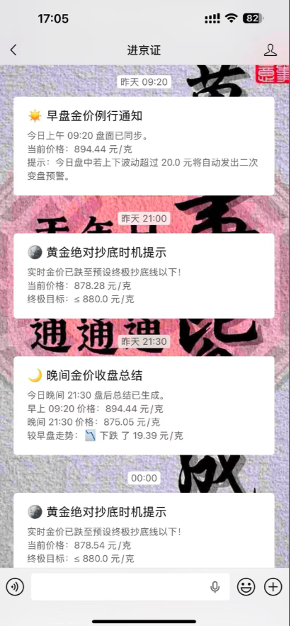

# 🪙 金价资产多重策略监控订阅系统 (V3.4)

一款轻量级、开箱即用的**黄金资产价格监控与多策略自动化通知系统**。支持通过 Server酱、钉钉机器人、飞书机器人等多个通道，根据自定义的时间、价格阈值或日内波动幅度，实时向您推送精细化的金价警报。

---

## 🚀 在线体验

💡 **一键直达前端配置中心**：[点击进入实时配置中心](http://lelegou-1252245128.cos.ap-chengdu.myqcloud.com/index.html)

> **工作流提示**：为了保障配置安全性，进入页面后请先选择您的“推送通道”并输入“接收凭证”，点击 **🔍 1. 查询并解锁配置** 验证成功后，即可解锁并实时同步云端监控引擎策略。

---

## ✨ 核心功能特性

* **多通道联动交叉校验**：前端配备全通道格式实时联动校验器，彻底杜绝因漏填、错填 Webhook 网址或密钥格式不正确导致的订阅失效。
* **三重精细化触发策略**：
    1.  **固定时间点通知**：支持自由勾选周一至周日、自定义具体时间点，定时为您汇报国内黄金结算换算价。
    2.  **达到固定价触发**：支持设置“高于/等于”或“低于/等于”特定阈值，实时捕捉盘面关键点位（每日仅触发现金价警报一次，避免轰炸）。
    3.  **日内变动异常触发**：系统自动捕获**今日 09:20 的盘面基准价**，当实时金价日内暴涨或暴跌绝对值超过您的设定阈值时，立即发出盘面剧烈波动警报。
* **安全限流与全量覆写**：后端集成 `flask_limiter` 严格防刷，订阅采用全量覆写排重机制，既可轻松添加多条规则，也能一键清空规则实现一键闭锁退订。

---

## 🛠️ 消息推送凭证（Token/Webhook）获取指南

📬 1. 如何获取 Server酱 接收密钥？(点击展开)

1. 访问 [Server酱 官网](https://sct.ftqq.com/) 并登录您的账号。
2. 进入 **「信道配置」**，选择您期望的接收方式（如微信服务号、企业微信、钉钉等）并完成绑定。
3. 进入 **「SendKey」** 页面，复制您的专属密钥（通常为 `SCT` 或 `SCU` 开头的英文字母与数字组合短串）。
4. **填写规范**：请直接复制该密钥短串填入系统的凭证输入框中，**切勿**携带任何 `http://` 或 `https://` 前缀。

🤖 2. 如何获取 钉钉群机器人 Webhook？(点击展开)

1. 打开钉钉电脑端，进入您需要接收通知的**钉钉群聊**。
2. 点击右上角 **「群设置」 -> 「智能群助手」 -> 「添加机器人」**。
3. 选择 **「自定义 (Custom)」** 机器人，点击添加。
4. **安全设置（必填）**：为了顺利通过校验，请在安全设置中勾选 **「自定义关键词」**，并添加关键词：`金价`。
5. 完成后，系统会生成一个完整的 Webhook 地址（例如：`https://oapi.dingtalk.com/robot/send?access_token=xxxxxx`）。
6. **填写规范**：您可以直接将**整个完整 URL 链接**或者仅把 `access_token=` 后面的 **Token 字符串**粘贴到配置中心，系统后端会自动识别清洗。

🕊️ 3. 如何获取 飞书群机器人 Webhook？(点击展开)

1. 打开飞书客户端，进入需要接收通知的**飞书群聊**。
2. 点击右上角 **「设置」 -> 「群机器人」 -> 「添加机器人」**。
3. 选择 **「自定义机器人」**，点击添加并为其设置名称。
4. **安全设置（可选）**：如需添加安全校验，建议使用关键词校验。
5. 完成后，复制系统生成的 Webhook 地址（例如：`https://open.feishu.cn/open-apis/bot/v2/hook/xxxxxxxxxxxx`）。
6. **填写规范**：您可以直接将**整个完整 URL 链接**或者仅把 `hook/` 后面的 **UUID 凭证**粘贴到配置中心，系统内置的清洗器将自动精准回显。

---

## 运行截图

## 📄 开源软件声明与架构

本系统采用经典的前后端分离架构构建：
* **前端（Frontend）**：单文件 HTML，基于 `TailwindCSS` 响应式布局与 `Axios` 异步流，提供极致轻量、优雅的交互工作区。
* **后端（Backend）**：基于 `Flask` + `SQLAlchemy (SQLite)` + `APScheduler` 定时任务管理引擎，金价接口请求具备多路重试机制，确保策略轮询的稳定性。

本系统代码完全开源，仅供技术研究、个人资产监控以及学术交流使用。您可以在遵守相关开源协议的前提下进行二次开发或私有化部署。

---

## ⚖️ 平台免责及风险提示声明

使用本系统前，请仔细阅读并知悉以下条款：

1.  **数据来源与非投资建议**：本系统发送的所有黄金盘面价格、实时涨跌变动信息均源自第三方公开 API（招商银行汇率网关、新浪财经盘面等）清洗换算，仅供技术研究与资产监控交流参考。在任何情况下，本系统内的任何数据与通知**均不构成任何形式的投资建议、财务顾问或买卖依据**。市场有风险，据此操作风险自担。
2.  **消息延迟与漏报风险**：鉴于国内外网络中转的复杂性、上游网关频次限流、第三方推送服务（Server酱/钉钉/飞书）网关波动等不可抗力因素，系统**可能存在极端情况下的消息推送延迟、失败或漏报**。用户不可完全依赖、强绑定本通知作为唯一的决策与风险对冲依据。
3.  **自负盈亏原则**：黄金盘面瞬息万变。因网络延迟、系统故障、断网、API 调整等导致的任何潜在交易错失、直接或间接财产损益，本系统及开发者**均不承担任何民事赔偿、经济损失或法律连带责任**。盘面变动请以各大官方交易所最终结算价为准。
